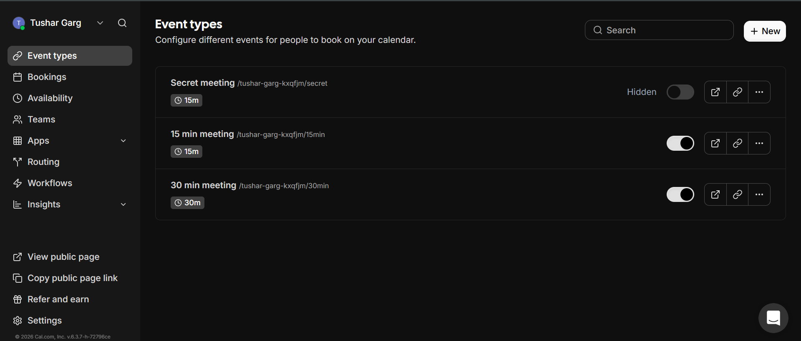
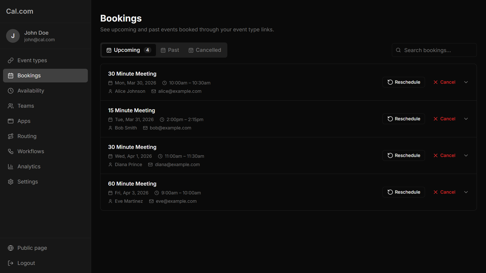
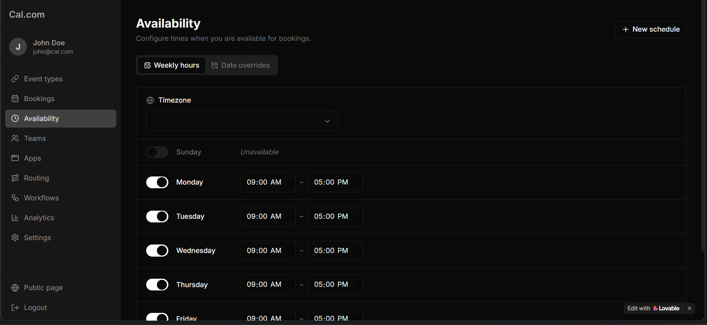
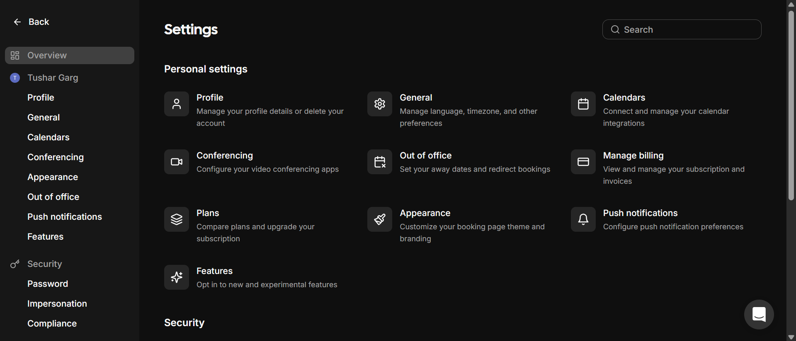
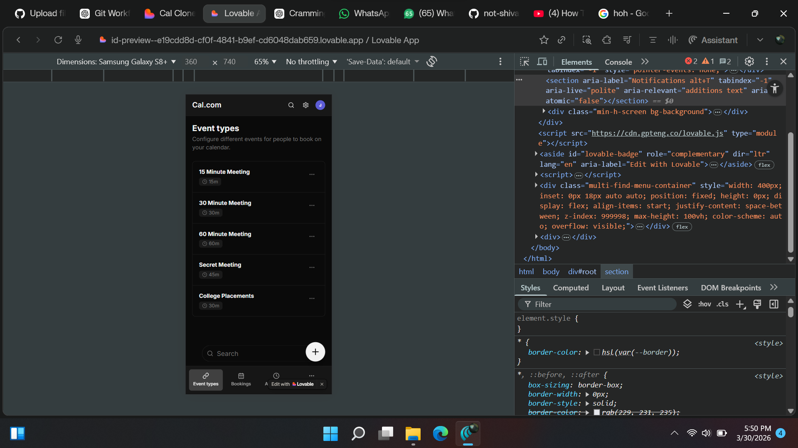

# 📅 Cal.com Clone – Fullstack Scheduling Platform

A fullstack scheduling and booking application inspired by Cal.com, built as part of an SDE Intern Fullstack assignment.

---

## 🔗 Live Demo

👉 [https://cal-beige-one.vercel.app/]

## 📦 Repository

👉 https://github.com/Tushar1478/cal-clone

---

## 🧠 Overview

This project replicates the core functionality and user experience of a modern scheduling platform like Cal.com.

Users can:

* Create event types
* Define availability
* Share booking links
* Allow others to book time slots

The focus was on **real-world product behavior**, **clean UI/UX**, and **functional scheduling logic**.

---

## ⚙️ Tech Stack

### Frontend

* React.js (TypeScript)
* Tailwind CSS
* Vite

### Backend

* Node.js (API handling)

### Database

* PostgreSQL (via Supabase)

### Tools

* AI-assisted development (ChatGPT, Gemini, etc.) for UI replication and debugging

---

## ✨ Features

### ✅ Core Features

#### 📌 Event Types Management

* Create, edit, and delete event types
* Define duration, description, and unique booking URL

#### ⏰ Availability Settings

* Configure available days and time slots
* Basic availability logic for scheduling

#### 🌐 Public Booking Page

* Calendar-based date selection
* Dynamic time slot generation
* Booking form (name + email)

#### 📊 Booking System

* Store bookings in database
* Basic conflict handling
* Booking confirmation UI

---

### ⚡ Bonus Features

* 📱 Fully responsive design (mobile + desktop layouts)
* 🎨 UI closely matches Cal.com
* 🧩 Modular component-based architecture

---

## 🚧 Limitations / Work in Progress

* ❌ Email notifications not implemented
* ❌ Some secondary features are mocked/demo-based
* ❌ Advanced edge cases (double booking race conditions) not fully handled

> Core scheduling flow is fully functional.

---

## 🧱 Application Flow

1. Admin creates event type
2. Availability is configured
3. Public booking link is generated
4. User selects date & time
5. Booking stored in PostgreSQL (Supabase)
6. Confirmation displayed

---

## 📸 Screenshots


### 📅 Event Types



### 🌐 Booking Page



### 🌐 Availability Page



### 🏠Settings



### 📱 Mobile View



---

## 🗄️ Database Design

Entities:

* Event Types
* Availability
* Bookings

Relationships:

* Event → Availability
* Event → Bookings

---

## 🧪 Setup Instructions

### 1. Clone repo

```bash
git clone https://github.com/Tushar1478/cal-clone.git
cd cal-clone
```

### 2. Install dependencies

```bash
npm install
```

### 3. Setup environment variables

Create `.env` file:

```
SUPABASE_URL=your_url
SUPABASE_KEY=your_key
DATABASE_URL=your_db_url
```

### 4. Run project

```bash
npm run dev
```

---

## 🎯 Assignment Alignment

This project implements key requirements from the assignment:

* Event type creation and management
* Availability configuration
* Public booking page
* Booking storage and display
* Responsive UI similar to Cal.com

---

## 🧠 Learnings

* Designing scheduling logic
* Working with relational databases
* Building responsive UI like production apps
* Using AI tools effectively while maintaining code understanding

---

## 📌 Assumptions

* Single user system (no authentication required)
* Simplified timezone handling
* Focus on core features first

---

## 🔮 Future Improvements

* Email notifications
* Authentication system
* Rescheduling and cancellation flows
* Better validation and error handling

---

## 🙌 Acknowledgement

Inspired by Cal.com and built as part of a fullstack engineering assignment.
